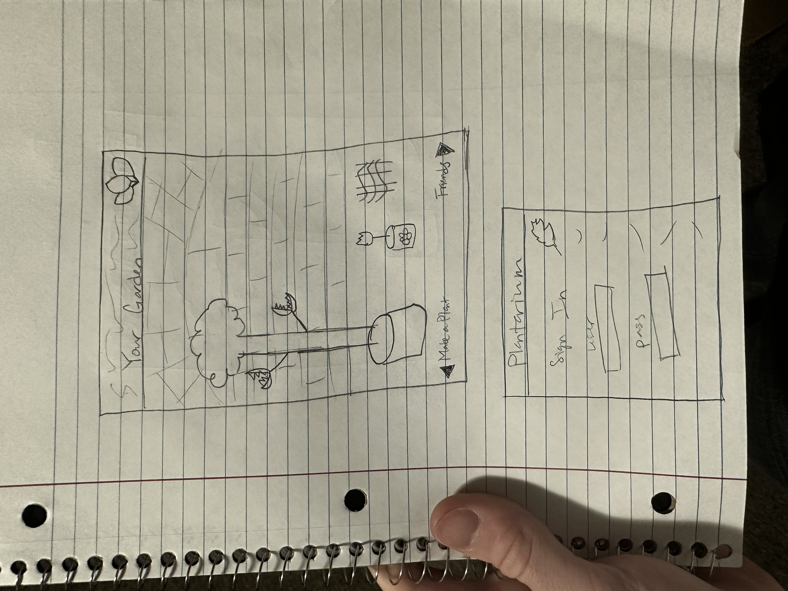
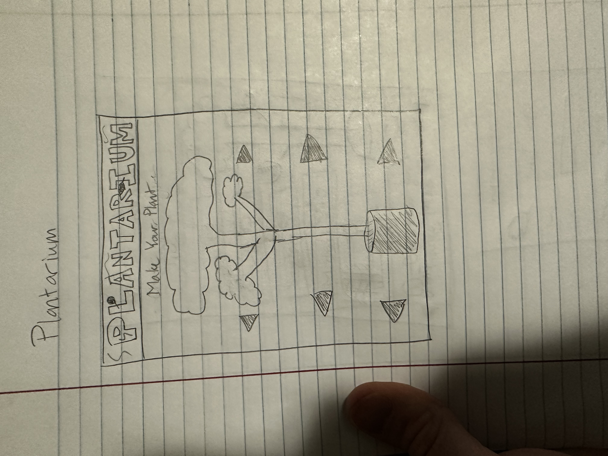
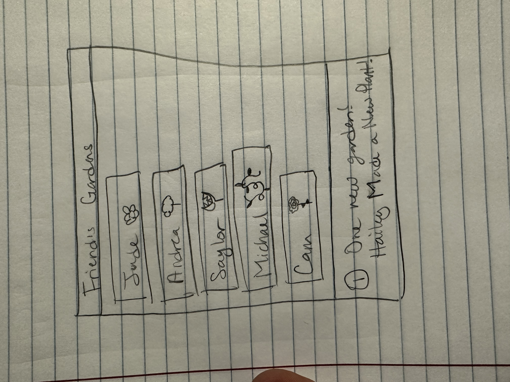

# startup
This file has been modified.
I was forced to modify it in Github :(
Oh to be a college student who practices redundancy.

I learned how to merge files and resolve the conflicts between them. I got familiar with the push and pull commands and some of the syntax of markdown. I learned how to use the functionality in VScode for committing - which I did not know before. I know how to push and pull from the terminal and from the IDE now and I also know how to commit from terminal, IDE and Github which is good because I was confused before. And now this is all on line 6 so we will see how that goes. I also learned how to save all using CTRL K and then S. I learned how to identify myself and set my identity for git too. I forked someone's code and, Finally, I was able to clone a repository that I made so that was pretty cool.
Always Add, Commit, Push until your fingers fall off.

## Startup Pitch
Have you ever wanted to create a crazy plant and show all your friends? No? Well now you do and now you can! Create over 100 different possible plants and make your custom garden to share with your friends! Get notified when another user makes a new plant so you can always be up to date on their gardens. Build your aesthetic and collection with Plantarium!
Features:
You choose the background to your garden. You choose from preset models which plant combinations you want to have in your garden. Customize your pot, your flowers, or your leaves to get the perfect plant for you. The app features a notification system which lets others know when you make a new plant and tells you when other users make new plants. You can also save your garden and come back anytime to find it waiting for you. Create a username and password and sign on!

## SIMON Feb 4 What I learned
./deployFiles.sh -k ~/keys/production.pem -h yourdomain.click -s simon
This deletes previous deployment of simon, copies all of the files in the directory, and tells caddy to host the files under the simon subdomain.
I learned a ton about the different html elements and their attributes and what they actually do. For example, the for attribute associates with an id and links the label to the input box so that when you click the name you are directed to the input. In addition I took it upon myself to study the paths and how that works. I learned that M is moveto and basically just specifies a point and another and another until you have a shape that can be filled. Unlike M, L actually draws lines as it moves. Q makes a quadratic curve starting that the last point previous to Q and going to the second input of Q. The first Q input is the focal point. I also learned how coordinates are counted in the viewBox. They start at the top left which is 0,0. Down is positive y, right is positive x. I was also able to just really get in my head how certain elements can be used and the organization of a page is displayed. It was confusing for a while because it seemed like many elements didn't produce noticeable effects, but now I'm seeing the potential for a lot of these division to be used for styling and interactivity purposes which really cleared a lot of confusion. I also learned that readonly is applied to input when you want it to just be display and not have the user input anything. Overall it was mostly learning about individual attributes and elements of which I made note of in repsective sections of this document. 
## Class Stuff
- `ssh -i filename ubuntu@IPaddress`
 server link: https://us-east-2.console.aws.amazon.com/ec2/home?region=us-east-2#ElasticIpDetails:AllocationId=eipalloc-063765021d2a9237d 
 IP address: 3.140.79.77
### Jan 27
`curl` is basically a command line browser. `curl -v` lets you see all the communication between your device and whatever url you put in after curl -v. Do `curl -v http://URL
- https is secure, http is not secure.
- Layers
Application (http), Transport (TCP- slower but more methodical, UDP-faster but more error prone), Internet (IP), Link (Physical connection like wiring)
- Web server has services within it.
- Multiple ports on a server. Port 443 is a secure http connection. You can have a gateway service on your web server that links to different ports ig.
- servers can talk to other servers. service are just programs in the servers
## Console Commands
`cd` -change directory
`mdkir` make directory
`touch` create files and modify metadata
`cp` copy files
`mv` move and rename files
`rm` delete files or directories
`curl` download files found at specific URLs
`grep` search for fragments of text inside larger bodies of text
`less` `cat` view file's contents
`awk` `tr` `sed` manipulate and transform streams of text
`cd path/to/directory`
ommitting the slash means the path is relative to your current directory
`cd ..` move back up one directory
`ls` list the stuff in the directory
`ls -l` list in more detail
`ls -al` list all files in more detail even the hidden ones
`--help` get info on command
`man` get info on command
`mkdir newDirectory`
`rmdir directory`
`rmdir -rf` remove directory and everything in it
`touch fileName`
`mv current/file/path new/file/path`
`cp current/path new/path`
`*` is a wildcard character
tldr.sh explains a lot of commands
`wc` counts # of words, lines, chars, or bytes of whatever is inputted
## GitHub
directory -> staged -> .git
git add puts on stage, git commit puts in into the repository, git checkout moves to a previous commit. Think about Github as like another person on a computer. It's just a server somewhere that holds git and takes your commits and passes them back out. git push - pushes a commit to a clone of your repository (usually to GitHub). git pull - pulls the newest commits down.
- When you create a repository you don't want git to be bugging you about putting things in the commit or something. Anything you put in the gitignore file won't be put in the repo.
## Development and Production environments
-my development environment is my computer and my production environment is AWS
-Never develop in the production environment
-Deployment of app should be done via a CI (continuous integration) process- this checkouts the application code, links it, builds it, tests it, stages it, tests it more, and finally pushes the application to the production environment and notifies.
-we are gonna use a simple console shell script for our CI process.
-to deploy run `./deployService.sh -k ~/prod.pem -h yourdomain.click -s simon` or something akin to that.
k provides the credential file to access production environment, h is domain name of prod environment, s is the name of the app you are deploying (simon or startup).

## The internet
IP addresses are the the addresses of servers. IP addresses are how computers find each other. We don't usually use the string of numbers and so we just use like google.com. Computers we use are clients bc they are not directly connected to the internet. They use an ISP (internet service provider). When info is transfered on the internet it's transferred in packages that are reassembled at arrival. IP addresses also apply to things indirectly connected to the internet. Anywhere two or more parts of the internet intersect, there is a router. Routers direct our packets of info around. When you send something, the info is wrapped in layers of all the IP addresses it passes through (routers have IP addresses). Info can go back to where it came from by looking at the IPs it's wrapped in and retracing its steps.
### TCP/IP layers
1. Application- user functionality, web (http), mail, files, remote shell, chat. 
2. Transport (TCP)- breaks application layer into small chunks and sends the data.
3. Internet (IP)- makes the connections, devices need IP addresses to talk ex. 128.187.16.184 (BYU), we usually use domain names as a stand in for IP addresses. Doing a lookup in the DNS (Domain name system) can convert domains names to ip addresses. Use `dig byu.edu` to find the IP address for byu on your terminal. To connect a device first asks for a connection route which consists of hops around the network until a path is discovered and connection established. Then the Transport and application layers start exchanging data. To elucidate the path, use the `traceroute byu.edu` to see how your computer connects. If you run `traceroute` again you might get a different path since it's dynamic.
4. Link- physical connections and hardware

## Web Servers
- Monolithic web servers- http software on a hardware server, olden days,  these are outdated now we have dynamic functionality with allows us to generate HTML on demand in reponse to users

- Web and application service can be combined ig
- Web service gateways- they run on the common http port 443. Since multiple web services can be run on the same computing device, different ports are used so a unique connection can be made to each. The gateway or reverse proxy basically listens on 443 and directs the user to the proper port.

- Microservice- web service that provides a single functional purpose. Since functionality is partitioned it can be managed independently from other stuff in a large system. They are also good at handling large differences in user volume by just running more instances of the service.

- I guess we're serverless now?? This section really made no sense.

## Domain Names
- Sometimes there are multiple IP addresses associated with one domain name. This is in case one address fails to make a valid connection. Domain name- text string listed in a database called domain name registry
- root domain with subdomain prefixes. TLD (top level domain)- is things like com, edu, or gov
so the root domain is like byu.edu, google.com, alabama.gov, etc. ICANN controls the list of TLDs.
- you can have any number of subdomains off the root domain ex. highways.utah.fed.gov has three subdomains.
- use `whois byu.edu` to get info about a domain name off the DNR.

## DNS
- once the domain is in the registry it is listed with a domain name system (DNS) server. You also need to lease the IP address. Every DNS on earth references a few special DNS servers that are the authority in charge of associating domain names with IP addresses. 
- we mainly want to look at the address (A) and the canonical name (CNAME) records.
- A- maps from domain name to IP address
- CNAME- maps one dmain name to another domain name (this acts like a domain name alias). *CNAME could do things like map byu.com to the same IP as byu.edu so that either will get you to the website
- enter domain name into browser, browser checks to see if it has the name already in its cache of names, if not it contacts a DNA server and gets IP address. If the DNS server doesn't have the domain name it requests the name from an `authoritative name server` DNS. If that doesn't know you get a unknown domain name error. If the name is found, your browser makes an Http connection to the associated IP address. 
- TTL (time to live)- different caching layers will honor the TTL and clear cache after requested period has passed.
- you can pay to lease an unused domain name.

## Caddy
web service gateway that listens for incoming Http requests. Caddy then serves up the files or routes the request to another web service. The ability to route requests is called a `gateway` or `reverse proxy` and allows you to exponse multiple web services as a single external web service. 
- handles creation and rotation of web certificates which allows us to easily support https
- serves up all our static html, css, and javascript files,

### Important Caddy files
* config file ~/Caddyfile
- contains definition for routing http requests that caddy receives. Never modify this file manually except when you configure domain name of your server.
* HTML files ~/public_html
- directory of files caddy serves up when requests are made the root of your web server.
## Web Services
* NS record - name server record and basically provides legitimacy between the DNS records and registration so that it knows you have lisence to use your domain name. It contains the names of the authoritative name servers that authorize you to place DNS records in this DNS server. Those same authoritative name servers are listed with the registrar that you leased your domain name from. That way the server can verify that the DNS records and registration match and are authorized to represent the domain name when defining DNS records
* SOA record - start of authority, provides contact info about the owner of the domain
## Security
- https - secure hypertext transport protocol (http with a secure connection before any data exchange happens). Secure connection means that data is encrypted using TLS protocol.
- TLS works by negotiating a shared secret that is then used to encrypt data. (use curl -v to see this)
- modern browsers expect servers to only use https and the next version of http will only support secure connections so any web application should be built with a secure connection.
### Web Certificates
- genertated by trusted 3rd party using encryption. Th issuer is responsible for verifying thst the certificated owner actually owns the domain name. So once I have a certificate, I can serve it from the server, the browser can see it and validate it using the public keys of whoever issued me the certificate.
- Ever since `Let's Encrypt` was made, certificates have become free and the web has become a safer place.
1. HTTPs request made
2. Caddy asks let's encrypt to verify that domain for requested certificate is owned by requester. 
3. L.E. tells requester to return a digitally signed response for a temporary URL when the request is made
4. L.E. makes http request and if successful they give the certificate to the owner.

## HTML (Hypertext Markup Language)
foundational content structure all web apps build on. Originally a format for web docs or pages. Now a page represents a single page application (SPA) or a large group of hyperlinked pages that form a multipage application (MPA).
- text is valid HTML
- always include `<!DOCTYPE html>` at the top of the HTML file. This tells the browser the type and version of the document
#### Elements and tags
Elements are represented with enclosing tags. 
- tag- a delimited textual name we use to designate the start and end of an HTML element as it appears in an HTML document.
- tags are delimited with < and >
- the closing tag will have / before its name.
`
Helloworld
` This denotes that this is a paragraph.
- You could write a thing like this- 
`<html>`
  `<head>`
    `<title>My First Page</title>`
  `</head>`
 ` <body>`
    `<main>`
      `
Hello world
`
    `</main>`
  `</body>`
`</html>`
and it would appear the same as ours above because HTML is about structure.
the above means:
* html- about top level page structure
* head - about page and page title
* body - content
* main- main content excluding headers, footers, navigation helps, etc.
#### Attributes
attributes describe specific details of the element. ex. the `id` attribute gives a unique ID to the element so you can distinguish it from other elements.
- `class` attribute- designates element as beeing classified into a named group of elements. 
-written in the element tag with aname followed by an optional value. 
`
Hello world
`
##### Common attributes
`name` name of imput. submitted as the name of the input if used in a form, can be used to reference the element in javascript
`disabled` disables the ability for the user to interact with the input
`value` the initial value of the input
`required` signifies that a value is required in order to be valid
`for` associates label with a control element

#### Hyperlinks
-represented with an anchor `a` element that has an attribute containing the address of the hyperlink reference.
- ex. `<a href="https://byu.edu">Go to the Y</a>`

#### Common elements
`html` page container
`head` header information
`title` title of page
`meta` metadata for the page such as character set or viewport settings
`script` JavaScript reference. 
`include` external content reference
`body` entire content body of page
`header` header of main content
`footer` footer of main content
`nav` navigational inputs
`main` main content of page
`section` a section of the main content
`aside` aside content from the main content
`div` a block division of content
`span` an inline span of content
`h<1-9>` text heading. From h1, the highest level, down to h9, the lowest level
`p` a paragraph of text
`b` bring attention
`table` table
`tr` table row
`th` table header
`td` table data
`ol, ul` ordered or unordered list
`li` list item
`a` anchor the text to a hyperlink
`img` graphical image reference
`dialog` interactive componenet such as a confirmation
`form` a collection of user input
`input` user input field
`audio` audio content
`video` video content
`svg` scalable vector graphic content
`iframe` inline fram of another HTML page
#### Comments
`<!-- commented text -->` this will be ignored when the browser renders the doc
#### Special Characters
- if you want to use special characters you need to escape them using entity syntax.
& - `&amp;`
< - `&lt;`
> - `&gt;`
" - "
' - '
😀 - `&#128512;`
etc.
#### HTML Versions
Year	Version	Features
1990	HTML1	format tags
1995	HTML2	tables, internationalization
1997	HTML3	MathML, CSS, frame tags
1999	HTML4	external CSS
2014	HTML5	email, password, media, and semantic tags

#### Rendering HTML
- You can save any HTML file to your disk and then open the file in your browser or you can open it in VScode and use the Live Server extension to display html. 
#### HTML Structure
#### HTML Input Elements
`form` input container and submission
`fieldset` labeled input grouping
`input` multiple types of user input
`select` selection dropdown
ex.
  `<select id="select" name="varSelect">`
    `<option selected>option1</option>`
    `<option>option2</option>`
    `<option>option3</option>`
`optgroup` grouped selection dropdown
`option` selection option
`textarea` multiline text input
`label` individual input label
`output` output of input
`meter` display value with a known range
* form used to be necessary but since Javascript, it has lost much of its usefulness.
##### To set the type of Input:
- use the type attribute
text - single line textual value
password - obscured password
email - email address
tel - telephone number
url - url address
number - numerical value
checkbox - inclusive selection
radio - exclusive selection
range - range limited number
date - year, month, day
datetime-local - date and time
month - year, month
week - week of year
color - color
file - local file
submit - button to trigger form submission
#### HTML Media elements
`img, audio, and video` are just references to external files.
`svg and canvas` internal media elements that contain code for rendering a visual image that can even be animated
* media tags that reference external media all take URL as an attribute. you can put the url as a relative path or a full path. Make the path as relative as possible so that if you change your code it doesn't affect the url.
`img` - specify the `src` attribute with the url to the source image. specify an `alt` attribite to describe the image for accessibility.
`audio` - uses src, include `controls` if you want the user to be able to control the audio playback (it makes a visual representation of the audio) `autoplay` starts the audio as soon as the audio file is loaded `loop` keeps playing it over and over
`video` - uses src, controls, and autoplay, you may need to include `crossorigin="anonymous"` if you are requesting files from a different domain than the one serving your content
`svg` - scalable vector graphics, allows you to render graphics inline in your HTML. Lots of attributes yeah
`canvas` - facilitates 2D drawing and animation, requires javascript to work
#### SVG Path Code
M = moveto
L = lineto
H = horizontal lineto
V = vertical lineto
C = curveto
S = smooth curveto
Q = quadratic Bézier curve
T = smooth quadratic Bézier curveto
A = elliptical Arc
Z = closepath

### Command for running simon
./deployFiles.sh -k ~/keys/production.pem -h yourdomain.click -s simon
This deletes previous deployment of simon, copies all of the files in the directory, and tells caddy to host the files under the simon subdomain.

## CSS (Cascading Style Sheets)
animate, display custom fonts, respond to user actions, alter layout of page dynamically based off of device being used
Functionality of CSS
- defining rulesets or rules
- a rule is comprised of a `selector` that selects elements to apply the rule to, as well as a `declaration` or two or however many that represent the `property` to style with the given `property value`.
consider this rule:
EX. `selector`p{
 `property`color: green;`green is the value`
 `line is the declaration`
}
Ex. p {
      color: green;
    }
The following rule:
Ex. p {
      font-family: sans-serif;
      font-size: 2em;
      color: navy;
      text-shadow: 3px 3px 1px #cccccc;
    }
selector p selects all paragraph elements in the doc. The 4 declarations then change font, increase size, change text color, create a shadow.
### Associate CSS w/ HTML
1. use the style attrtibute on an HTML element and explicitly assign one or more declarations.
ex. `
CSS
`
2. use the style ELEMENT- not attribute- to define CSS rules w/in the doc. This should appread in the head element of the doc so the rules apply to the whole thing.
3. use the link element to create a hyperlink reference to an external file containing CSS rules. This must also be in the head element. This is the preferred way.
Elements inherit the rules applied to their parents, so lower level declarations override higher level ones to allow for specificity.
### The box model
CSS defines everything as a box. Styles apply to everything in the box. Inner to Outer.
- the element's content (text)
- the padding (stuff like background color)
- border (color, thickness, line style)
- margin (considered external to the styling of the box and so represents whitespace)
The default width and height of an element is the width and height of the content box (the innermost box). YOu can changed the `box-sizing` CSS property from default `content-box` to `border-box` to redefine width and height to also include padding and border. This can make it easier to style elements when their visual size matches their actual size.
### Selectors
the selector will determine which elements are affected by the rule. `*` is a wildcard selector that selects all elements.
You can be more specific with selectors by using `descendant combinators`. For instance, saying section h2 {
  color: #004400;
}
would only apply the color to h2 elements who were within or "descended from" section elements.
#### Combinators
- Descendant - anything within; div p (selects all p elements within div elements)
- Child - one level within; div > p (selects all p elements that )
- General Sibling - div ~ p (selects all p that follow a div and have the same parent elements as div)
- Adjacent Sibling - div + p (selects p that is immediately following a div and has the same parent elements as div)
#### Class Selectors
any element can have 0 or more classifications
to use the classification in a rule do
.classnamehere {
  stuff to implement
}
you can also combine element with class
ex.
p.summary{
  stuff
}
this changes all p items of summary class.
#### ID Selector
prefix id with `#`
ex.
#idhere {
  stuff
}
changes the element with that id.
#### Attribute Selector
support wildcards
ex.
p[class='summary'] {
  color: red;
}
this changes all p elements with the class attribute of summary
a[href] selects every a element with the href attribute
#### Psuedo Selector
section:hover {
  blah blah
}
changes the section only when mouse is hovering over it.